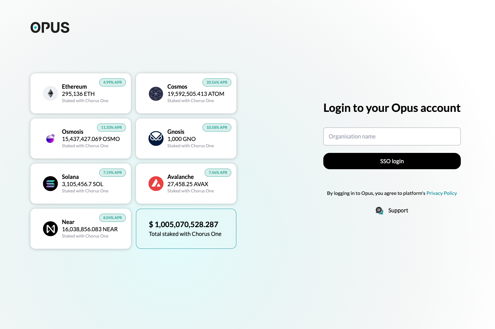
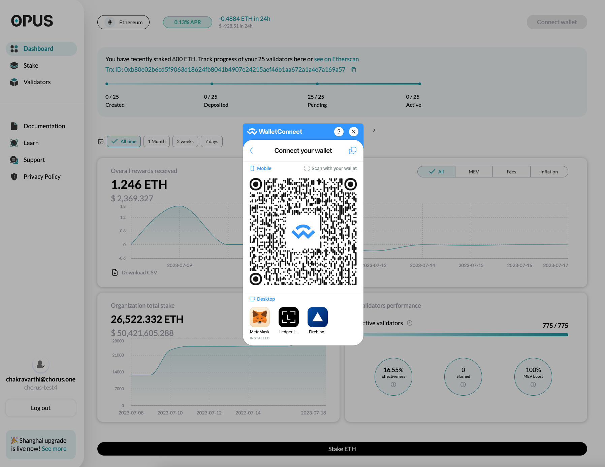
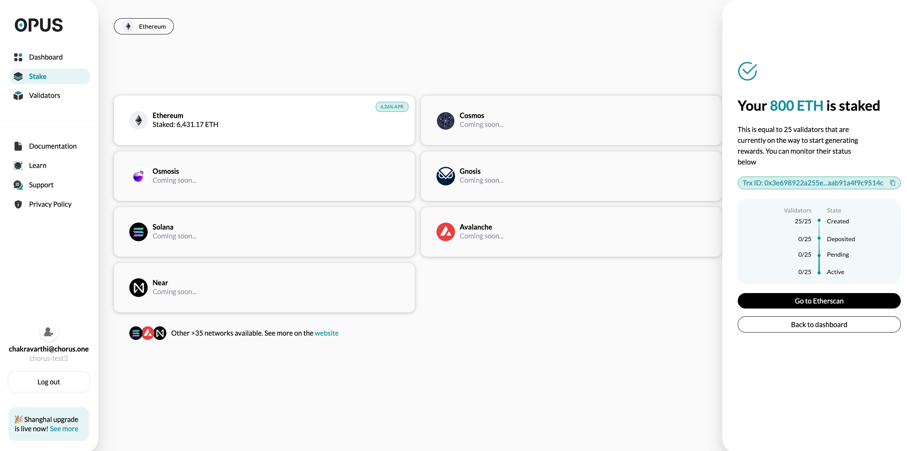
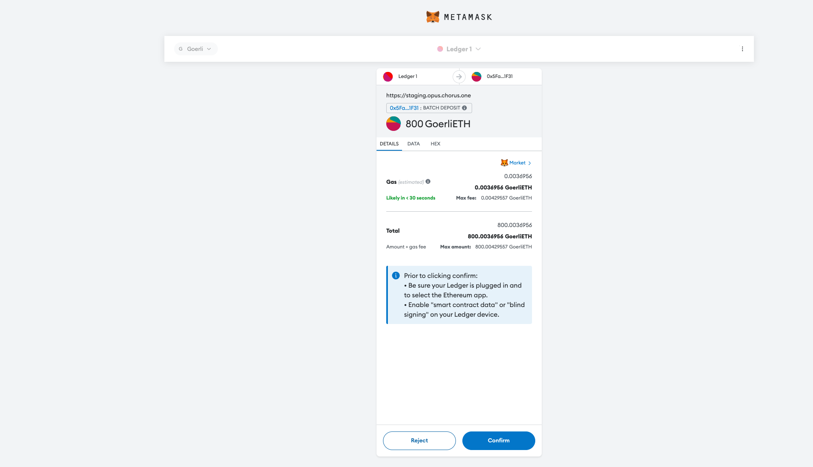

# How to stake ETH on OPUS via Ledger/Metamask

<figure><figcaption></figcaption></figure>

This step-by-step guide is designed to help you stake Ethereum on OPUS. Throughout this guide, we will break down the process into simple, manageable steps.

&#x20;

1\. Connect Ledger to Metamask

* _We assume that you have a ledger with some ETH, and versed with using Ledger. Please reach out to our team for any support here._
* Please follow the instructions found in this link to connect Ledger with Metamask: [https://support.ledger.com/hc/en-us/articles/4404366864657-Connect-your-Ledger-to-MetaMask?docs=true](https://support.ledger.com/hc/en-us/articles/4404366864657-Connect-your-Ledger-to-MetaMask?docs=true)

💡 Tip: If you face the below error(0x650f), please follow this [link](https://support.ledger.com/hc/en-us/articles/4987786461469-Solving-the-UNKNOWN-ERROR-0x650f-in-MetaMask?support=true) to resolve the error.\
💡 Tip: After this configuration, Metamask doesn’t have access to Ledger private keys. This configuration allows Ledger to leverage Metamask as a visual interface.

<figure><figcaption></figcaption></figure>

2\. Enable Blind Signing on Ledger by following the steps shown in this link: [https://support.ledger.com/hc/en-us/articles/4405481324433-Enable-blind-signing-in-the-Ethereum-ETH-app?support=true](https://support.ledger.com/hc/en-us/articles/4405481324433-Enable-blind-signing-in-the-Ethereum-ETH-app?support=true)

**You have now successfully connected Ledger to Metamask. Next step is to Login to OPUS Poral.**

3\. Our sales team must have sent you your login credentials. If not, please reach out to them here.

4\. Now, please enter your organization name, and login with SSO.

<figure><figcaption></figcaption></figure>

5\. Connect Metamask to OPUS.

<figure><figcaption></figcaption></figure>

6\. Select Amount of ETH using the Slider.

<figure><figcaption></figcaption></figure>

💡 Tip: OPUS Staking slider helps you stake up to 800 ETH(25 Validators) in one transaction.

💡 Tip: OPUS staking screen shows the backward looking APR, and projected rewards.

&#x20;

7\. Confirm stake transaction on Metamask.

<figure><figcaption></figcaption></figure>

8\. Approve transcation on Ledger

* **Steps involved:** Review Transaction > Blind Signing > Amount 800 ETH > Address > Network > Max Fees > Accept and Send

<figure><figcaption></figcaption></figure>

‍**You have now staked Ethereum on OPUS. To stake more, please follow the guide from step #6.**

<figure><figcaption></figcaption></figure>

**If you are facing any issues, please reach out to** [**us at Chorus One support**](mailto:support@chorus.one) **or submit a ticket.**
