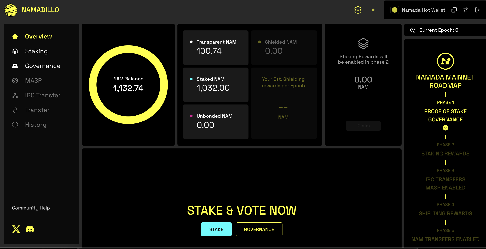

# How to stake NAM (Namada)

<figure><figcaption>
Source: <a href="https://x.com/namada/header_photo">https://x.com/namada/header_photo</a>
</figcaption></figure>

## Overview

<table data-header-hidden><thead><tr><th width="242"></th><th></th></tr></thead><tbody><tr><td><mark style="color:blue;"><strong>CATEGORY</strong></mark></td><td><mark style="color:blue;"><strong>DETAILS</strong></mark></td></tr><tr><td><strong>Chorus One Validator</strong></td><td><a href="https://namada-explorer.sproutstake.space/validators/7C02D0D72034F41FDBEC1BCB106F58B401F2838B53B1A0F535D3FE0B3BA0B925">tnam1qxsx2ezu89gx252kwwluqp7hadyp285tkczhaqg0</a> or search for Chorus One on the <a href="https://interface.namada.tududes.com/staking">Namada Staking</a> page.</td></tr><tr><td><strong>Recommended Wallet</strong></td><td><a href="https://namada.net/keychain">Namada Keychain</a> (Chrome or Firefox only)</td></tr><tr><td><strong>Block Explorers</strong></td><td><a href="https://namada.info/">https://namada.info/</a> | <a href="https://namada-explorer.sproutstake.space/">https://namada-explorer.sproutstake.space/</a> | <a href="https://explorer75.org/namada">https://explorer75.org/namada</a></td></tr><tr><td><strong>Unstaking Period</strong></td><td>14 days</td></tr></tbody></table>

## About Namada

**Namada (NAM)** is a proof of stake (PoS) layer-1 blockchain from the Anoma foundation designed to prioritize privacy in multi-asset transactions using zero-knowledge proof technology and focusing on interchain asset-agnostic data protection.

* [What is Namada?](https://namada.net/blog/what-is-namada)
* [Introducing Namada: Multichain Asset-Agnostic Data Protection](https://namada.net/blog/introducing-namada-multichain-asset-agnostic-data-protection)

Built on the Tendermint consensus engine, it uses a mechanism called Zcash Sapling Protocol to enable shielded transfers, allowing users to transact privately while supporting interoperability with other blockchains.&#x20;

Namada stands out for its native multi-asset support, meaning any asset from connected chains or created within Namada can benefit from its privacy features without needing custom contracts.

The platform also introduces an innovative feature called Privacy as a Public Good. It rewards users for using private transactions by allocating a portion of transaction fees and staking rewards to fund privacy-centric initiatives.&#x20;

Namada aims to enhance privacy across the blockchain ecosystem, offering a solution that seamlessly integrates privacy with usability, making it accessible for both developers and end-users.

***

## How to stake NAM

### 1. Install the Namada Keychain browser extension

To begin, you will need to Namada Keychain, which can be downloaded here:&#x20;

* [https://namada.net/keychain](https://namada.net/keychain)


Please note that currently the [Namada Keychain](https://namada.net/keychain) is only supported on **Chrome** and **Firefox**.&#x20;

If you already have the Namada Keychain installed, skip ahead to: [How to stake](how-to-stake-nam-namada.md#id-2.-how-to-stake)


<figure><figcaption>
Example of the Namada Keychain webpage.
</figcaption></figure>

Next, set up your wallet by either creating a new wallet via a 12 or 24-word phrase from the Namada Keychain, or connect via Ledger which will require having already installed the Namada app from Ledger Live.&#x20;

* See: [Ledger's guide on installing the Namada app](https://support.ledger.com/article/17870289537437-zd)

If you are creating a new wallet from the Namada Keychain directly, please be sure to store your 12 or 24-word phrase securely.&#x20;

You will be prompted to enter some random words from your seed phrase to ensure you wrote it down correctly. Next, you will be prompted to set a password for your Namada Keychain.&#x20;


Your seed phrase cannot be recovered if lost. Please be sure to write this down somewhere secure and never share it with anyone.&#x20;

Anyone with access to your seed phrase will have access to your funds.&#x20;

* It is not advisable to store this digitally or as a screenshot.&#x20;


***

### 2. How to stake

Next, navigate to [https://interface.namada.tududes.com/](https://interface.namada.tududes.com/) to view the overview interface for Namada.

* You can either click on the blue 'Stake' button in the bottom-center of the screen or click on the Staking tab on the left hand panel of the screen. &#x20;

<figure><figcaption>
Example of the Namada overview interface.
</figcaption></figure>

You can search for Chorus One in the search bar or enter the Chorus One validator address to find the correct validator from the [Staking interface](https://interface.namada.tududes.com/staking).&#x20;

* `tnam1qxsx2ezu89gx252kwwluqp7hadyp285tkczhaqg0`

Simply click on 'Stake' and you will be brought to the staking page.&#x20;

<figure><figcaption>
Example of the Namada staking interface.
</figcaption></figure>


You may need to search for Chorus One again to find it from the list of available validators.&#x20;


<figure><figcaption>
Example of staking 50 NAM to Chorus One.
</figcaption></figure>

Simply enter how much NAM you wish to stake with Chorus One and then complete the transaction in your Namada Keychain and sign the transaction.&#x20;

<figure><figcaption></figcaption></figure>

You will be prompted to enter the password you set for your Namada Keychain wallet to finalize the transaction.

<figure><figcaption></figcaption></figure>


Once you have approved the transaction, you have successfully staked your NAM!


***

### 3. Increasing and managing your NAM stake

If you'd like to increase or manage your NAM stake, you can do so from the [Namada Overview](https://interface.namada.tududes.com/) page or the [Namada Staking](https://interface.namada.tududes.com/staking) page.&#x20;

<figure><figcaption>
Enter the amount of NAM you would like to increase your stake by. 
</figcaption></figure>

Follow the same steps as before to approve and finalize your staking transaction.&#x20;

***

### 4. Unstaking your NAM

If you wish to unstake your NAM, this can be done from the [Namada Staking](https://interface.namada.tududes.com/staking) page which will provide an overview of your staked balances and which validators you have delegated to.&#x20;

Below is an example of how it may look for you.&#x20;

* You will see the options to Stake, Redelegate, or Unstake.&#x20;

<figure><figcaption>
Example of the Namada Staking interface.
</figcaption></figure>

To unstake, simply click on the 'Unstake' button and follow the prompts to approve and finalize the transaction, similar to the steps taken to stake your NAM originally.&#x20;


When unstaking your NAM, please note that it will take 14 days to complete during which time your staked balance will not be earning staking rewards.

After this period has passed, your NAM will become liquid again and you can transact with it.&#x20;


***

## A Note to Institutional Investors

If you are an institutional investor looking to stake Namada (NAM) with Chorus One, please reach out to us via our [staking request form](https://shorturl.at/znows).&#x20;


