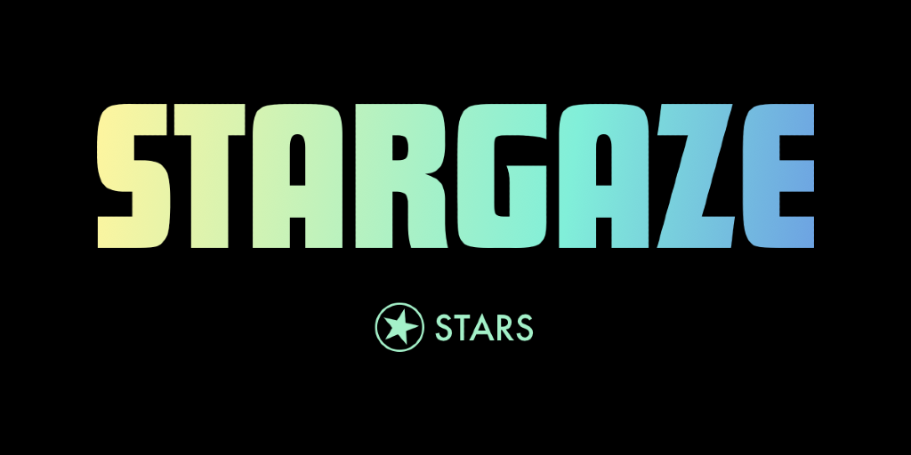

# NEW TEMPLATE - Based on STARS How to stake \_\_\_\_\_ (\_\_\_\_\_\_)

<figure><figcaption>
Source: <a href="https://www.stargaze.zone/">https://www.stargaze.zone/</a>
</figcaption></figure>

## Overview 

<table data-header-hidden><thead><tr><th width="242"></th><th></th></tr></thead><tbody><tr><td><mark style="color:blue;"><strong>CATEGORY</strong></mark></td><td><mark style="color:blue;"><strong>DETAILS</strong></mark></td></tr><tr><td><strong>Chorus One Validator</strong></td><td><a href="https://www.mintscan.io/stargaze/validators/starsvaloper16pj5gljqnqs0ajxakccfjhu05yczp987esm6lu">starsvaloper16pj5gljqnqs0ajxakccfjhu05yczp987esm6lu</a> or use: <a href="https://chorus.one/crypto-staking-networks/stargaze">https://chorus.one/crypto-staking-networks/stargaze</a></td></tr><tr><td><strong>Recommended Wallets</strong></td><td><a href="https://www.keplr.app/">Kelpr</a> or <a href="https://www.leapwallet.io/">Leap</a> </td></tr><tr><td><strong>Block Explorer</strong></td><td><a href="https://www.mintscan.io/stargaze">https://www.mintscan.io/stargaze</a></td></tr><tr><td><strong>Staking Rewards</strong></td><td><a href="https://www.stakingrewards.com/asset/stargaze">https://www.stakingrewards.com/asset/stargaze</a></td></tr><tr><td><strong>Unstaking Period</strong></td><td>21 Days</td></tr></tbody></table>

## About Stargaze

**Stargaze (STARS)** is a decentralized, community-driven blockchain network designed for the creation and exchange of NFTs (non-fungible tokens). Built on the Cosmos SDK, Stargaze takes advantage of the interoperability and security features of the Cosmos ecosystem, particularly the Inter-Blockchain Communication (IBC) protocol, which allows it to connect with other Cosmos-based networks.&#x20;

This integration facilitates seamless interaction across various chains, making it easier for users to exchange NFTs and assets with other platforms in the Cosmos ecosystem. Stargaze’s architecture emphasizes a user-friendly, accessible NFT marketplace where creators and collectors can interact without relying on centralized platforms.

The platform operates on its native token, STARS, which serves multiple functions within the network.&#x20;

* STARS can be staked to secure the network, used to pay transaction fees, and participate in governance, giving token holders a say in network upgrades and policies.&#x20;
* Stargaze’s governance model is fully decentralized, allowing the community to make decisions on protocol changes and marketplace improvements.&#x20;

This democratic approach, combined with the focus on NFT creation and trading, aims to build a thriving ecosystem for digital artists, collectors, and investors within the Cosmos blockchain environment.

***

## How to Stake STARS 

### 1. Install the Keplr Wallet Extension 

For the focus of this guide, we recommend using the [Keplr wallet](https://www.keplr.app/). While Leap is usable, this guide will be walking through a demonstration with Keplr.

However, if you would like to use Leap wallet and stake directly to the [Chorus One validator](https://www.mintscan.io/dymension/validators/dymvaloper1ema6flggqeakw3795cawttxfjspa48l4x0e2mh) via Mintscan, you can reference the quick guide below to start your Leap wallet.

If you already have a wallet installed, feel free to skip ahead to [Stake your STARS](new-template-based-on-stars-how-to-stake-_____-______.md#h_01hc8b1t0x326w2f4nzezyfjz6).

Optional: How to install the Leap wallet

First, download your Leap wallet&#x20;

* You can find their official site here: [https://www.leapwallet.io/](https://www.leapwallet.io/)

For maximum compatibility, Chromium-based browsers like Google Chrome or Brave are recommended, however, Firefox should work too.&#x20;

Next, ensure that you have the Leap wallet extension downloaded and enabled in your browser.

Once installed, you can create a new wallet, import an existing wallet like Keplr, or log in with a hardware wallet such as Ledger.&#x20;

**If you choose to create a new wallet you will be shown 12 words as your mnemonic seed.**&#x20;

**Please be sure to back up your mnemonic seed securely.**&#x20;

* It is recommended to store it physically, not in a digital format or as a screenshot.

<mark style="color:red;">**Never share this seed phrase with anyone, as they will have access to your funds.**</mark>&#x20;

It's important to remember that:

* A lost mnemonic seed phrase cannot be recovered.
* Anyone with your mnemonic seed phrase can take control of your assets.

Next, you will be asked for the mnemonic again to ensure you recorded it.&#x20;

* Enter the 12 words in order and case sensitive (all lower case).&#x20;

You will then be prompted to create a password for your Leap wallet.&#x20;

Your Leap wallet is all set to go! Click on '**Launch Extension**' to begin using your new wallet.


In case you don't have the Keplr extension installed in your browser, please visit [https://www.keplr.app/](https://www.keplr.app/) and click on 'Install Keplr'.


<figure><figcaption></figcaption></figure>

<figure><figcaption>
Example of the installation screen using Brave browser.
</figcaption></figure>

Click on **Install Keplr for Chrome** if you are using a Chrome browser or **Brave** if you are using the Brave browser and follow the installation instructions.

***

### 2. Create/Import an Account 

Click on the extension in the Chrome/Brave toolbar and the following page will open up.

* It is recommended to pin it to your browser toolbar by clicking on the jigsaw piece 🧩 icon and then the pin :pushpin: icon.

<figure><figcaption>
Select to either create a new wallet, import an existing wallet, or connect with a hardware wallet.
</figcaption></figure>


In case you do not have an existing Keplr account you can click 'Create a new wallet'.&#x20;

If you already have a wallet to use, you can select 'Import an existing wallet' or you can connect with a compatible hardware wallet, such as a Ledger device.

* Alternatively, Keplr now offers the ability to associate your wallet with your Google account, however, this is a **less secure** way of establishing your wallet and is not recommended.&#x20;


<figure><figcaption>
Here you can choose between creating, importing, or associating your wallet with your Google account. 
</figcaption></figure>

**If you choose to create a new wallet you will be shown 12 words as your mnemonic seed.**&#x20;

* **Optional:** You can select the 24 words option for a more secure mnemonic.&#x20;


**Please be sure to back up your mnemonic seed securely.**&#x20;

* It is recommended to store it physically; never in a digital format or as a screenshot.

**Never share this seed phrase with anyone, as they will have access to your funds.**&#x20;

* A lost mnemonic seed phrase cannot be recovered.
* Anyone with your mnemonic seed phrase can take control of your assets.


Next, enter an account name and a passphrase to lock and unlock your wallet. You will be asked for the mnemonic again.&#x20;

* Enter the 12 or 24 words in order and case sensitive (all lower case).&#x20;
* This is to make sure you remember the mnemonic and confirm that you wrote it down correctly.

<figure><figcaption>
Example of the screen that will show your recovery phrase.
</figcaption></figure>

After verifying your 12 or 24 word phrase, you will be prompted to select any other Cosmos Hub networks you'd like to add to your wallet.&#x20;

* **In this case, we will be adding Stargaze (STARS), so please be sure to select that from the list or use the search bar to find it.**


No need to add any other networks if you don't plan on using them yet. You can always select more networks later. &#x20;

However, it is advisable to have '**Cosmos Hub**' selected when creating your new wallet.


<figure><figcaption>
Be sure to search for STARS in the list in addition to Cosmos Hub.
</figcaption></figure>

Once you selected the relevant networks you want to use, click 'Save' and you'll be all set to go.&#x20;

<figure><figcaption>
All set!! Your Keplr wallet is good to go!
</figcaption></figure>

***

### 3. Log in to your Keplr wallet 

Regardless of whether you already have an wallet or if you just created it, you can now click on the Keplr extension to view your address or visit [https://wallet.keplr.app/?tab=overview](https://wallet.keplr.app/?tab=overview) to see your full Keplr dashboard.

<figure><figcaption>
Example of the Keplr dashboard.
</figcaption></figure>

### 4. Stake your STARS 

If you don't already have some STARS tokens in your wallet, you can fund it with some tokens. You may use an exchange to transfer the tokens to your address or get them from a trusted third party that already holds some.

If you want to stake from the browser extension wallet, you can either navigate to the [Keplr dashboard](https://wallet.keplr.app/) (shown below) or scroll down on the wallet screen and select STARS.&#x20;


Alternatively, you can connect Keplr to the Mintscan explorer and stake to the Chorus One validator at this address: [starsvaloper16pj5gljqnqs0ajxakccfjhu05yczp987esm6lu](https://www.mintscan.io/stargaze/validators/starsvaloper16pj5gljqnqs0ajxakccfjhu05yczp987esm6lu)

Or you can navigate to thenChorus One staking page and click on 'Stake Now'

* [https://chorus.one/crypto-staking-networks/stargaze](https://chorus.one/crypto-staking-networks/stargaze)


Next, you will be prompted to stake.&#x20;

<figure><figcaption>
How to access the dashboard from the wallet browser extension
</figcaption></figure>

<figure><figcaption>
Scroll down to find STARS or use the search bar.
</figcaption></figure>

If you click on STARS directly from your wallet extension, you will see the option to stake. Click on that to be taken to the STARS page of your dashboard.&#x20;

<figure><figcaption>
Example of the STARS dashboard in Keplr.
</figcaption></figure>

Alternatively, if you are already on the [Keplr dashboard](https://wallet.keplr.app/), to stake click on the 'Stake' tab on the left hand side of the dashboard.

<figure><figcaption>
Keplr dashboard example
</figcaption></figure>

Once there, you will see three steps highlighted in the pink box in the screenshot below.&#x20;

1. **Select Chain**
2. **Select Validator**
3. **Stake**

Scroll or through the list or search for the chain you want, in this case **STARS**.

* Then, repeat the same steps to find the Chorus One validator.

<figure><figcaption>
Example of using the Keplr wallet screen to choose your chain and validator. 
</figcaption></figure>

Once you've chosen the Chorus One validator, select how many STARS tokens you wish to stake, then click the 'Stake' button at the bottom of the screen.

Clicking on Stake will take you to Keplr wallet for approval. Approve the transaction and you will be able to see your stake.

* **Note:** If you are using a Ledger hardware wallet, you will need to have the wallet connected, unlocked, and approve the transaction there.&#x20;

<figure><figcaption>
Example of the STARS staking screen with Chorus One selected.
</figcaption></figure>


Please note that there is a 21 day unbonding process (also known as unstaking) for STARS.

During this period your stake no longer earns rewards and cannot be transferred, exchanged, or spent.

However, you can cancel the unstaking process if you wish without penalty.&#x20;


***

### 5. Claiming Rewards 

After some time you will see rewards accumulating in your wallet.&#x20;

* This can be easiest to view from the [Keplr dashboard](https://wallet.keplr.app/).&#x20;

<figure><figcaption>
Example of how available rewards will display from the Keplr dashboard.
</figcaption></figure>


You can simply go to the [Keplr dashboard](https://wallet.keplr.app/) to claim them by selecting 'Claim' and approving the transaction.&#x20;

* You will see all rewards available from all networks you are staking with.&#x20;
* You can choose to claim all pending rewards or select which networks you specifically want to claim rewards for.&#x20;


***

### 6. Unstaking your STARS

If you wish to unstake your STARS tokens, you can do so from the same interface in Keplr that you used to stake.&#x20;

* Either go to the [Keplr dashboard](https://wallet.keplr.app/) or manage your asset directly from the browser extension window.&#x20;

<figure><figcaption>
Example of managing your STARS stake in the wallet extension.
</figcaption></figure>

<figure><figcaption>
Example of the Keplr dashboard where you can see your active stake and selected validators. 
</figcaption></figure>

Simply click on the validator you wish to unstake from and you will be prompted with the following screen.&#x20;

<figure><figcaption>
Example of the staking &#x26; unstaking screen.
</figcaption></figure>


Please note that STARS undergoes a 21 day unbonding period when unstaking.&#x20;


To proceed, click on 'Unstake' and follow the prompts to select the amount of STARS you wish to unstake.

Then confirm and sign the transaction in your wallet.&#x20;


And that's it! Your STARS tokens will begin unbonding which you can track from your [Keplr dashboard](https://wallet.keplr.app/) under the Staking tab.

You can view and manage all ongoing unstaking transactions (undelegations) from your Keplr dashboard and cancel them if you change your mind.&#x20;


<figure><figcaption>
Example above showing a STARS unstaking transaction in progress. 
</figcaption></figure>


After the unbonding period is complete you will be able to transact with your unstaked STARS tokens again!


***

## A Note to Institutional Investors:

If you are an institution looking to stake Stargaze (STARS) with Chorus One, please reach out to us via our [staking request form](https://shorturl.at/znows).&#x20;

<strong>About Chorus One</strong>

Chorus One is one of the biggest institutional staking providers globally, operating infrastructure for 60+ Proof-of-Stake networks, including Ethereum, Cosmos, Solana, Avalanche, and Near, amongst others.&#x20;

Since 2018, we have been at the forefront of the PoS industry and now offer easy enterprise-grade staking solutions, industry-leading research, and also invest in some of the most cutting-edge protocols through Chorus Ventures.&#x20;

We are a team of over 50 passionate individuals spread throughout the globe who believe in the transformative power of blockchain technology.

