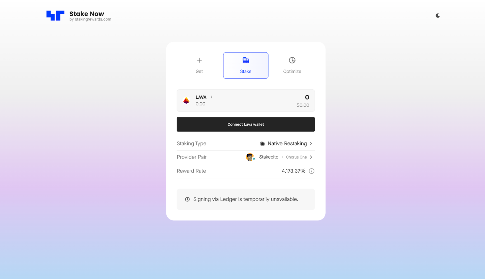

# OLD - Previous LAVA guide

## Overview&#x20;

This is a detailed step-by-step guide for staking and native restaking LAVA with Chorus One easily via the [Staking Rewards App](https://www.stakingrewards.com/stake-app?input=lava\&type=dual-staking\&providers=chorus-one;0\&secondary-providers=stakecito;0).


Below is a quick outline of the steps we will cover in this guide:


Step 1: Visit the [Staking Rewards app](https://www.stakingrewards.com/stake-app?input=lava\&type=dual-staking\&providers=chorus-one;0\&secondary-providers=stakecito;0)

Step 2: Connect your wallet

Step 3: Choose your provider pair provider pair (Stakecito + Chorus One)

Step 4: Enter the amount of LAVA you want to stake

Step 5: Confirm your transaction!

***

## How to Stake LAVA

### 1.) Navigate to the [Staking Rewards App](https://www.stakingrewards.com/stake-app?input=lava\&type=dual-staking\&providers=chorus-one;0\&secondary-providers=stakecito;0)

<figure><figcaption></figcaption></figure>

Next, you'll need to connect your compatible wallet. While [Keplr](https://www.keplr.app/) is supported, for this guide, we will be demonstrating with [Leap wallet](https://www.leapwallet.io/).&#x20;


If you don't already have a  Keplr or Leap wallet, check out the instructions in the dropdown menu below for a quick getting started [guide](old-previous-lava-guide.md#how-to-install-leap-wallet).&#x20;


### 2.) Connect your Leap Wallet

Click on '**Connect Lava wallet**' to open up the next window where you can select which wallet you wish to connect with.&#x20;

<figure><figcaption></figcaption></figure>

From here, select the Leap wallet option. You will be prompted to change your network connection in Leap to the Lava Network.&#x20;

* Go ahead an approve this to begin interfacing with the Staking Rewards App.

<figure><figcaption></figcaption></figure>

### 3.) Choose your Provider

If you have not already chosen your provider pair (Stakecito + Chorus One), click on the arrow and hit the **Add Provider Pair** button.


It may be already selected by default for you, as shown in the screenshot below.&#x20;


<figure><figcaption>
Example of the provider pair selected by default.
</figcaption></figure>

If you find that the Stakecito + Chorus One provider pair is not selected, click on the displayed provider pair, then click on '**Add Provider Pair**'.


For the next two screens, you will choose your provider pairs. You can either scroll through the list, or type the name in the search bar to find your selections.&#x20;


<figure><figcaption></figcaption></figure>

After selecting Stakecito, click on '**Continue to Validator**'.&#x20;

From here you can search for Chrous One, select it, and click on '**Add Provider Pair**'.

<figure><figcaption></figcaption></figure>

### 4.) Choose your Delegation Amount

Next, you'll see your selected provider pair and your available LAVA to balance.  Now that the provider pair is selected, enter the amount of LAVA you want to stake and natively restake.

* Once you've decided, click on '**Continue to stake**'.&#x20;

<figure><figcaption></figcaption></figure>

### 5.) Finalize your Staking Transaction&#x20;

Next, you will be prompted to sign the transaction in your Leap Wallet. This will appear as a pop-up window from your Leap wallet browser plugin.&#x20;

<figure><figcaption></figcaption></figure>


Congratulations you have successfully staked and restaked your LAVA!


<figure><figcaption></figcaption></figure>

***

## A Note to Institutional Investors:

To learn more or to if you are an institution looking to stake LAVA with Chorus One, please reach out to us via our [staking request form](https://shorturl.at/znows).&#x20;
