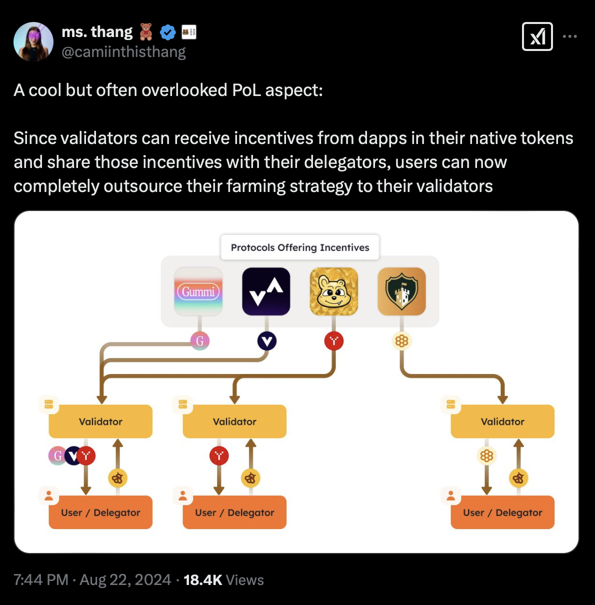

# \[OLD TESTNET] of How to stake BERA (Berachain)

<figure><figcaption></figcaption></figure>

***


Chorus One is excited to announce that BERA staking is now possible using Chorus One validators via Bitgo. Regardless of if you're holding liquid of unvested BERA tokens, you can create your own White Label (WL) validator.&#x20;

Please reach out to us via our [staking request form](https://chorusone.my.salesforce-sites.com/WebToLead) to get started!


## Chorus One & BeraBoost

Chorus One has pioneered the [BeraBoost Algorithm](old-testnet-of-how-to-stake-bera-berachain.md#the-beraboost-algorithm) to maximize BGT rewards for stakers.&#x20;

With Berachain’s unique emission mechanics, delegators need a sophisticated strategy to maximize returns. This is where **BeraBoost** comes in—an automated allocation algorithm developed by Chorus One Research that dynamically optimizes BGT distribution to maximize rewards.

* To learn more, please see: [BeraBoost: Maximizing Chorus One Delegator Rewards](https://chorus.one/reports-research/beraboost-maximizing-chorus-one-delegator-rewards)
* Or see: [Stake BERA with Chorus One: A comprehensive overview of Berachain, Proof-of-Liquidity](https://chorus.one/articles/stake-bera-with-chorus-one-a-comprehensive-overview-of-berachain-proof-of-liquidity)

## Overview 

***

<table data-header-hidden><thead><tr><th width="211"></th><th></th></tr></thead><tbody><tr><td><mark style="color:blue;"><strong>CATEGORY</strong></mark></td><td><mark style="color:blue;"><strong>DETAILS</strong></mark></td></tr><tr><td><strong>Chorus One Validator</strong></td><td><a href="https://hub.berachain.com/validators/0xab98ea73f3afab04154829f8d12a537cbf31a8b08f7f8e3870f4902001f0011234ed8f9218b40b4ed732d11d889f609d/">0xF2048c29ef806ed003dEE1ae703F00ef7340AC84</a> (Bera Hub)  <a href="https://berascan.com/address/0xf2048c29ef806ed003dee1ae703f00ef7340ac84">0xF2048c29ef806ed003dEE1ae703F00ef7340AC84</a> (Berascan)</td></tr><tr><td><strong>Recommended Wallet</strong></td><td><a href="https://metamask.io/download/">MetaMask</a></td></tr><tr><td><strong>Block Explorer</strong></td><td><a href="https://berascan.com/">https://berascan.com/</a></td></tr><tr><td><strong>Stake with Chorus One</strong></td><td><a href="https://chorus.one/crypto-staking-networks/berachain">https://chorus.one/crypto-staking-networks/berachain</a></td></tr><tr><td><strong>Connecting to Testnet</strong></td><td><a href="https://docs.berachain.com/developers/network-configurations">https://docs.berachain.com/developers/network-configurations</a></td></tr></tbody></table>


[Bera Hub](https://hub.berachain.com/) is the central dashboard to interact with the Berachain ecosystem. Unfortunately it will not be accessible for users coming from a US-based IP address.

[https://hub.berachain.com/](https://hub.berachain.com/)


## About Berachain

**Berachain (BERA)** is revolutionizing how DeFi users interact with liquidity, optimizing applications, and enhancing flexibility within the digital economy. Built using the Cosmos SDK, Berachain introduces its novel Proof-of-Liquidity (PoL) consensus mechanism and its modular execution framework, BeaconKit, which ensures full compatibility with unmodified Ethereum Virtual Machine (EVM) execution clients.

Through the Proof-of-Liquidity (PoL) consensus mechanism, Berachain redefines traditional staking by integrating liquidity provisioning into network security and governance. Instead of requiring users to lock assets in traditional staking contracts, PoL encourages liquidity contributions to the ecosystem. This model operates with a dual-token system:

* **BERA** – The native gas token used for transaction fees and network security.&#x20;
  * Validators stake BERA to participate in securing the chain.
* **BGT** (Bera Governance Token) – A non-transferable, governance-focused token distributed to users who contribute liquidity.&#x20;
  * Users can delegate BGT to validators, influencing their rewards and emissions.

This structure aligns incentives between validators, liquidity providers, and decentralized applications (dApps) and users who supply liquidity to Berachain receive LP tokens, which can be staked to earn BGT.&#x20;

The more BGT a validator receives in delegation, the higher their emissions, reinforcing an economic model that prioritizes liquidity depth and network engagement.


Chorus One has pioneered the BeraBoost Algorithm to maximize BGT rewards for stakers.&#x20;

To learn more, please see: [**BeraBoost: Maximizing Chorus One Delegator Rewards**](https://chorus.one/reports-research/beraboost-maximizing-chorus-one-delegator-rewards)


By integrating BeaconKit as its execution layer, Berachain maintains full EVM compatibility while leveraging the modular flexibility of the Cosmos SDK. This combination enhances interoperability, scalability, and the overall efficiency of DeFi applications built on the network.

Ultimately, Berachain’s approach not only addresses liquidity fragmentation but also creates a sustainable, incentive-driven model for securing and growing the DeFi ecosystem.

***

### **What is Proof of Liquidity(PoL)?**

To support the PoL model, Berachain utilizes a tri-token model comprising the Bera Governance Token (BGT), the native gas token (BERA), and Honey (HONEY).&#x20;

Each token serves a specific role:&#x20;

* **BGT** is central to governance and staking, granting holders voting rights for protocol decisions and access to rewards through whitelisted liquidity pools.
* **BERA** powers transactions within the network.&#x20;
* **HONEY** facilitates lending, borrowing, and liquidity provision, driving ecosystem activity.&#x20;


BGT plays a central role in the staking process on Berachain. It grants holders governance rights, enabling them to vote on proposals that shape protocol upgrades.&#x20;


* Users can earn BGT by participating in PoL or staking BERA directly to a validator.&#x20;
* For PoL participants, BGT rewards are distributed through rewards vaults tied to particular liquidity pools, which must first be approved and whitelisted through a governance approval process.&#x20;
  * Once a pool is whitelisted, users can contribute liquidity to these vaults and receive BGT rewards in return.

Together, this tri-token model creates a robust and dynamic economic framework that aligns network security, liquidity, and governance. While currently still in its testnet phase, Berachain’s innovative model is poised to reshape blockchain staking upon mainnet launch.

***

## Chorus One and BeraBoost

Chorus One has been involved with the ongoing developments of Berachain and their new PoL model and is prepared to offer day one support for the network. Alongside this, we have created a special algorithm called BeraBoost to maximize BGT rewards for PoL participants allowing Chorus One to provide infrastructure that maximizes the performance of the PoL system, ensuring that liquidity is efficiently managed while securing the network through the use of our in-house algorithm.

### The BeraBoost Algorithm:&#x20;

Chorus One optimizes rewards distribution for liquidity providers and validators on Berachain. This approach maximizes returns for BGT delegators by tracking LP positions and directs incentives to the most relevant reward vaults.

BeraBoost maximizes delegator income by strategically distributing BGT emissions to their reward vault positions. This is a sophisticated approach that takes into account nuances like vault turnover and varying incentive liquidity.&#x20;

Chorus One's BeraBoost operates on a public dashboard, providing transparent, optimized incentive capture for delegators. BeraBoost maximizes incentives taking into account delegator reward vault positions and Chorus One will continue to improve BeraBoost as the chain matures.

### How BeraBoost Works

Validators on Berachain play a crucial role in emission allocation. Delegators who stake with a validator benefit from the validator’s strategy for directing emissions to Reward Vaults. BeraBoost takes this a step further by:

* Algorithmically distributing emissions to maximize delegator rewards on their reward vault positions.
* Transparently directing liquidity where it is most needed.
* Reducing the complexity of staking for delegators by automating the yield-maximization process.

This mirrors how traditional DeFi yield farming strategies work but integrates them directly at the consensus level. As Camila Ramos highlighted in [this thread](https://x.com/camiinthisthang/status/1826692027679211689), Berachain’s PoL effectively allows users to **outsource their farming strategies to validators**, providing an avenue for both sophisticated and unsophisticated users to optimize their returns without active management.


Learn more about BeraBoost [here](https://chorus.one/reports-research/beraboost-maximizing-chorus-one-delegator-rewards).


<figure><figcaption>
Source: <a href="https://x.com/camiinthisthang/status/1826692027679211689">https://x.com/camiinthisthang/status/1826692027679211689</a>
</figcaption></figure>

***

## How to stake BERA

### Berachain Testnet Links

Below are the links you can use to get started on Berachain testnet if you'd like to explore the PoL mechanisms and staking process first-hand.&#x20;


The Berachain testnet faucet is the first place to begin to get some testnet BERA.



BEX is the home of the swap and liquidity provisioning features to participate in PoL.



BGT Station is your all in one stop to stake your liquidity tokens and delegate BGT and interact with other features of the network.&#x20;


### How to stake to Chorus One

Once you've acquired some testnet tokens, you can use [BEX](https://bartio.bex.berachain.com/) to swap your BERA into different tokens you wish to provide liquidity for.  For example, let's say you wanted to provide liquidity to the BERA/HONEY pool.

First, navigate to [https://bartio.bex.berachain.com/swap](https://bartio.bex.berachain.com/swap) and select how much BERA you wish to swap to HONEY.&#x20;


Note: When providing liquidity, you will need to provide a roughly 50/50 distribution in value of each token. For example, $100 worth of BERA and $100 worth of HONEY.&#x20;


<figure><figcaption></figcaption></figure>

You will see a preview of your swap, go ahead and complete the steps by approving the transaction in your wallet.&#x20;

Once you have the tokens you want to provide liquidity for, navigate to [https://bartio.bex.berachain.com/pools](https://bartio.bex.berachain.com/pools) to select the liquidity pool you wish to interact with.&#x20;

In this case, we will be demonstrating with the HONEY/BERA pool.&#x20;

* **Note:** When you deposit your BERA to a pool, it will become wBERA.&#x20;

<figure><figcaption></figcaption></figure>

Click on 'Add' to be brought to the liquidity deposit screen. You can click on 'MAX' for either token to see what the most liquidity you can provide is based on the amounts of each token you have.&#x20;

<figure><figcaption></figcaption></figure>

Next, click on 'Preview' and if it all looks good, go ahead and approve the transaction in your wallet and provide the liquidity to the pool.&#x20;

After you've done so, you'll likely be prompted to deposit your liquidity receipt tokens to a rewards vault to begin earning BGT. (screenshot example below).&#x20;

* However, if you are not, you can navigate to [BGT Station](https://bartio.station.berachain.com/gauge) to proceed with the next steps.&#x20;

<figure><figcaption></figcaption></figure>

From [BGT station](https://bartio.station.berachain.com/gauge), make sure you select the tab at the top called '[Vaults](https://bartio.station.berachain.com/gauge)' and from there you can search for a rewards vault for HONEY/WBERA to stake you receipt tokens to.&#x20;

* You might see a lot of possible rewards vaults (aka "gauges") to stake receipt tokens to.&#x20;
* You can use the search bar to find the HONEY/WBERA vault where you can stake your receipt token.&#x20;

<figure><figcaption>
Using the search function can be very helpful to find the vault you wish to use. 
</figcaption></figure>

Simply click on 'Deposit' and you can stake your liquidity receipt tokens from your deposit earlier.&#x20;

<figure><figcaption></figcaption></figure>

Enter the amount of the receipt tokens you wish to stake, then click on 'Deposit' to finalize the transaction in your wallet.&#x20;


And now you've successfully participated in PoL! Your receipt tokens will begin accruing BGT rewards that you can claim and then stake with the Chorus One validator.&#x20;


However, it's worth noting that BGT will not be instantly earned for your receipt token deposit, however, you will begin earning BGT from your stake in that rewards vault.&#x20;

As it accrues, you can claim your pending BGT rewards.&#x20;

* The screenshot below shows an example of BGT rewards that have accrued in the HONEY/WBERA vault we staked the liquidity receipt token to earlier.&#x20;

<figure><figcaption></figcaption></figure>

Simply click on 'Claim Rewards' and you will claim the BGT that has accrued from the rewards vault.&#x20;

If you are staking to other rewards vaults, you can see an overview of all your pending BGT rewards from: [https://bartio.station.berachain.com/rewards](https://bartio.station.berachain.com/rewards)

Once you have your BGT, you can navigate to the '[Validators](https://bartio.station.berachain.com/validators)' tab of [BGT Station](https://bartio.station.berachain.com/gauge) to select Chorus One.&#x20;

* It can be useful to use the search bar to find the [Chorus One validator](https://bartio.station.berachain.com/validators/0x6bcBe50912a51c4d956444CCbd2F3e9dAA217CC1).

<figure><figcaption></figcaption></figure>

Once on the Chorus One validator page, simply click on 'Delegate' to delegate your BGT to the validator.&#x20;

<figure><figcaption></figcaption></figure>

Here you will see the screen where you can choose how much BGT to delegate.&#x20;

<figure><figcaption></figcaption></figure>

After you've entered how much BGT you wish to delegate, click on 'Queue Boost' which will start the delegation process.&#x20;


The delegation process is not instant. When you queue the BGT boost to the Chorus One validator, it will process in approximately 1-2 hours.&#x20;

You can view the status of your delegation boost from the same page you used to delegate.&#x20;


<figure><figcaption></figcaption></figure>


Please note that to finalize the BGT delegation, you will need to return to this page and confirm the boost after the time in the delegation queue has passed.&#x20;


After you've come back and confirmed your BGT delegation to the Chorus One validator, you're all set! You've successfully delegated BGT and have boosted the Chorus One validator further, thus increasing the amount of BGT it will distribute to your rewards vault (in this case, HONEY/WBERA).&#x20;


You will continue to accrue more BGT over time from your PoL positions which can be claimed from the '[Rewards](https://bartio.station.berachain.com/rewards)' tab of BGT Station.&#x20;


<figure><figcaption></figcaption></figure>

***

## Converting BGT to BERA


BGT cannot be transferred to another wallet. It is soul bound to your wallet. While BGT can be delegated, it can also be converted one way in a 1:1 ratio to BERA.&#x20;

Please note it is not possible to convert BERA back to BGT. This is a one way swap only.&#x20;


This allows you to use your BGT rewards to either further boost the Chorus One validator or you can swap your BGT to BERA to use it for other functions in the Berachain ecosystem.&#x20;

This 1:1 swap can be done from the '[Redeem](https://bartio.station.berachain.com/redeem)' tab on BGT Station.&#x20;

<figure><figcaption></figcaption></figure>

Simply select how much BGT you'd like to convert to BERA and click on 'Confirm' then finalize the transaction in your wallet.&#x20;


And that's it -- You've now converted your BGT rewards to BERA and can use that BERA to swap in BEX or participate in other aspects of the Berachain ecosystem!&#x20;


***

## A Note to Institutional Investors

If you are an institutional investor looking to stake Berachain (BERA) with Chorus One, please reach out to us via our [staking request form](https://shorturl.at/znows) or via email to staking@chorus.one


