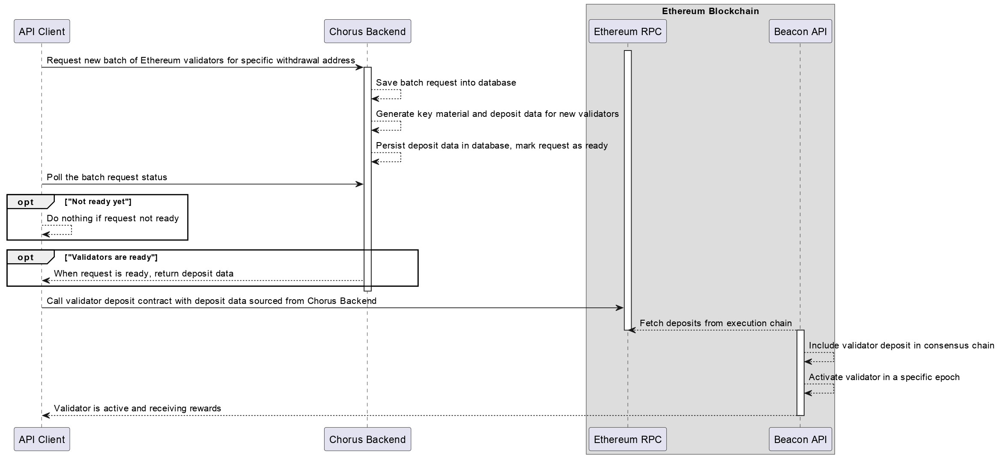
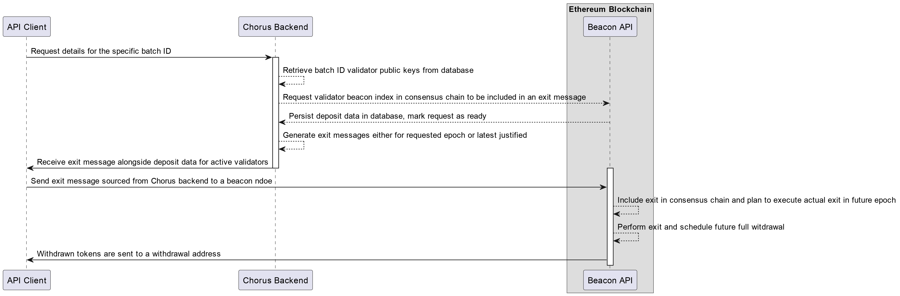

---
metaLinks:
  alternates:
    - >-
      https://app.gitbook.com/s/KGu77aAU8HQJ5FTwSgOi/our-products/chorus-one-ethereum-native-staking/api-integration-guide
---

# API integration guide

## Staking

The **Native Staking API** aims to simplify the process of staking by providing a set of endpoints that users can use to generate the key material and the deposit data needed to stake on Ethereum.

The API documentation is available at [**API Reference**](https://native-staking.chorus.one/docs) and provides detailed information on the available endpoints and their usage.

### Authentication

Every API request requires authentication via a bearer token in the `X-API-TOKEN` header. Once requested through the [Support Request](https://support.chorus.one/hc/en-us/requests/new) page, our team will provide you with a unique token for your tenant. To obtain a token, please provide the below in the request:

* Tenant name
* Tenant description to Chorus One representative.

> **Important**: Store your API token securely. Lost tokens cannot be recovered by Chorus One, but we can generate new one upon request for you.

How to use the token in your requests:

```bash
curl --header "X-API-TOKEN: your-token-here" https://native-staking.chorus.one/...
```

### Integration

#### **1. Request a batch of validators with deposit data**

Pre-requisites:

* An authentication token received from Chorus One
* A withdrawal address that you control

> ⛔️ **Important**: Losing access to the withdrawal address will result in losing access to the staked funds.

The process of depositing validators managed by Chorus is shown on a diagram.



An example request to create a batch of 10 validators on the **Mainnet** network:

```http
export TOKEN="your token here"
export WITHDRAWAL_ADDRESS="your withdrawal address here"
export FEE_RECIPIENT_ADDRESS="your fee recipient address here"
export BATCH_ID="your batch id here"
curl https://native-staking.chorus.one/ethereum/mainnet/batches/new \
-H "X-API-TOKEN:$TOKEN" \
-H "Content-Type: application/json" \
-d '{"batch_id": "$BATCH_ID", "withdrawal_address": "$WITHDRAWAL_ADDRESS", "fee_recipient": "$FEE_RECIPIENT_ADDRESS", "number_of_validators": 10, "network": "mainnet"}'
```

> 📝 **Note**: Rate Limits & Quotas
>
> * Each tenant receives a specific summary validator quota, for the total number of validators that can be created across all batches. This is intended as a sanity check, to protect against rogue automation creating millions of validators.
> * Rate limiting prevents accidental quota exhaustion
> * Contact Chorus One representative for quota increases
> * Single batch request can not exceed 200 validators, if you need more, need to issue multiple batch requests

**What happens on the backend:**

* The request is validated and persisted in the database
* A separate process generates the key material and the `deposit_data` for every new batch of validators
* The `deposit_data` is saved in the database as it does not contain any sensitive information
* The key material is stored securely and will be used by the validators to perform their duties on the network

**What needs to happen on client** **side**:

* Once new batch request have been created, API will return UUID that represents particular validators batch in Chorus One backend. Client must save this UUID and use it in further requests that concern newly generated validators. `/batches` endpoint can be used to retrieve UUIDs for all past requests.

#### **2. Monitor status of the batch**

Pre-requisites:

* An authentication token
* Previously saved UUID of the batch

An example request to get the status of the batch:

```bash
export TOKEN="your token here"
export BATCH_ID="your batch id here"
export EPOCH="epoch number here" # optional, will be used to generate the signed exit message for the provided epoch.
# If not provided, the current epoch will be used.

curl https://native-staking.chorus.one/ethereum/mainnet/batches/$BATCH_ID?epoch=$EPOCH \
-H "X-API-TOKEN:$TOKEN"
```

**What happens on the backend:**

* The request is validated and the status of the batch is retrieved from the database
* If all `deposit_data` has been generated, the status will be `ready` and the response will include the `deposit_data` for each validator. The status of the validators will be `created` awaiting the be deposited.

Validator status field in API output will update as follows:

* Initially validators show status as `created` after `deposit_data` generation
* Once deposited, activated on the network and starting to receive rewards, validators will show status as `active`
* Exited validators will show status as `exited`

#### **3. Deposit the validators on the Ethereum network**

For this, the user needs to:

* Extract the `deposit_data` for each validator.

```js
const TOKEN = "your token here"
const BATCH_ID = "your batch id here"

const response = await fetch(`https://native-staking.chorus.one/ethereum/mainnet/batches/${BATCH_ID}`, {
  headers: {
    "X-API-TOKEN": TOKEN
  }
})
const json = await response.json()
// get all deposit_data from the response
const depositDataArray = json.validators.map(validator => validator.deposit_data);
```

* Use the `deposit_data` to deposit the validators on the Ethereum network:
  * using the the official [Ethereum Staking Launchpad](https://launchpad.ethereum.org/en/overview)

```js
// generate the `deposit_data-[timestamp].json` file
const fs = require('fs');
fs.writeFileSync(`deposit_data-${Date.now()}.json`, JSON.stringify(depositDataArray));
```

Upload the `deposit_data-[timestamp].json` file to the Ethereum Staking Launchpad and follow the instructions to complete the deposit.

* Using an audited batch deposit contract

#### Main risks and remediations:

* The withdrawal address must be secured and not treated as a hot wallet. Best practice is to use a multisig wallet contract for this purpose.
* The withdrawal address should be dedicated to the purpose of Ethereum staking.

## Unstaking

Once a validator has been deposited on the Ethereum network, it will start earning rewards. However, there are situations where the user might want to stop validating and withdraw the funds. The earlist time a validator can be withdrawn is after 256 epochs, which is approximately 27 hours after the validator has been activated.

To unstake a validator, the user needs to provide an exit message for the validator. The exit message is a signed message that proves the ownership of the validator and is used to withdraw the funds. The exit message is generated by the Native Staking API and can be requested by providing the batch ID and the epoch number for which the exit message is needed. Once the validator has been exited, the funds will be sent to the withdrawal address provided during the staking process.

The process of exiting validators managed by Chorus is shown on a diagram.



**Pre-requisites:**

* An authentication token
* Previously saved UUID of the batch
* An epoch number for which the exit message is needed (optional, if not provided, the current epoch will be used)
* Access to an Ethereum beacon node API that supports voluntary exit endpoint described [here](https://ethereum.github.io/beacon-APIs/#/Beacon/submitPoolVoluntaryExit)

### Integration

1. Extract the `deposit_data` for each validator.

```js
const TOKEN = "your token here"
const BATCH_ID = "your batch id here"
const EXIT_EPOCH = "epoch number here" 

const response = await fetch(`https://native-staking.chorus.one/ethereum/mainnet/batches/${BATCH_ID}?epoch=${EXIT_EPOCH}`, {
  headers: {
    "X-API-TOKEN": TOKEN
  }
})
const json = await response.json()

const exitMessages = json.validators.map(validator => validator.exit_message);
```

2. Call the [voluntary\_exits](https://ethereum.github.io/beacon-APIs/#/Beacon/submitPoolVoluntaryExit) endpoint of the Ethereum beacon node API to submit the exit message for the validator.

```js
 const BEACON_NODE_URL = "your beacon node url here"
 exitMessages.forEach(async exitMessage => {
   const response = await fetch(`${BEACON_NODE_URL}/eth/v1/beacon/pool/voluntary_exits`, {
     method: 'POST',
     headers: {
       'Content-Type': 'application/json'
     },
     body: JSON.stringify(exitMessage)
   })
   const json = await response.json()
   console.log(json)
 })
```

> Note📝 Exiting a validator takes time and it depends on the network conditions, such as the `churn limit` which is the maximum number of validators that can exit in a single epoch.

3. Monitor progress of validator exit by visiting the [Ethereum Beacon Chain Explorer](https://beaconcha.in/) and searching for the validator's public key, or using automated process that polls API of Ethereum beacon node for validator status progression.
4. Actual withdrawn funds will arrive to withdrawal address in few days after validator is exited.

#### Main risks and remediations:

* If someone gains access to your exit messages, they can force your validators to exit. While the funds will remain secure and will be sent to the withdrawal address, you risk losing potential staking rewards. This is significant because withdrawing existing validators and activating new ones is a time-consuming process.

## Further Reading:

* [Ethereum Staking Overview](https://ethereum.org/en/staking/)
* [Ethereum Staking Launchpad](https://launchpad.ethereum.org/en/overview)
* [Ethereum Rewards Overview](https://eth2book.info/capella/part2/incentives/rewards/)
* [Ethereum Rewards Deep Dive](https://hackmd.io/@potuz/HJGTPDz1n)
