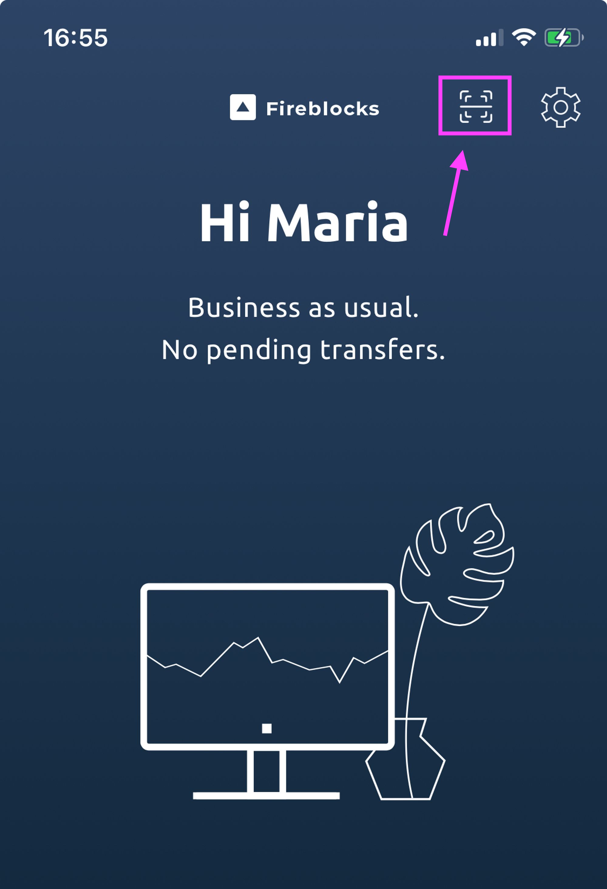
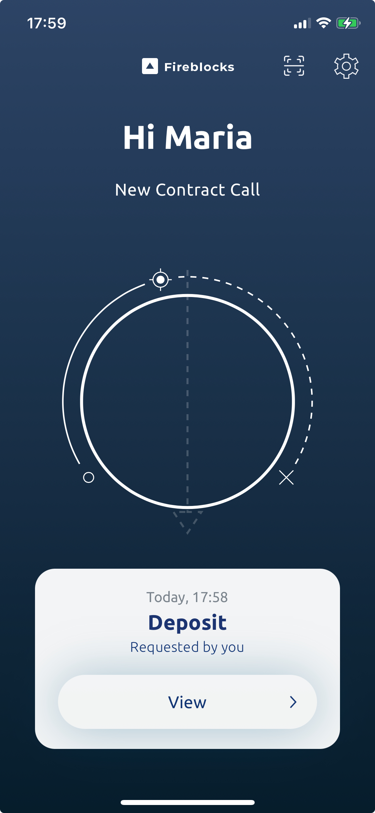
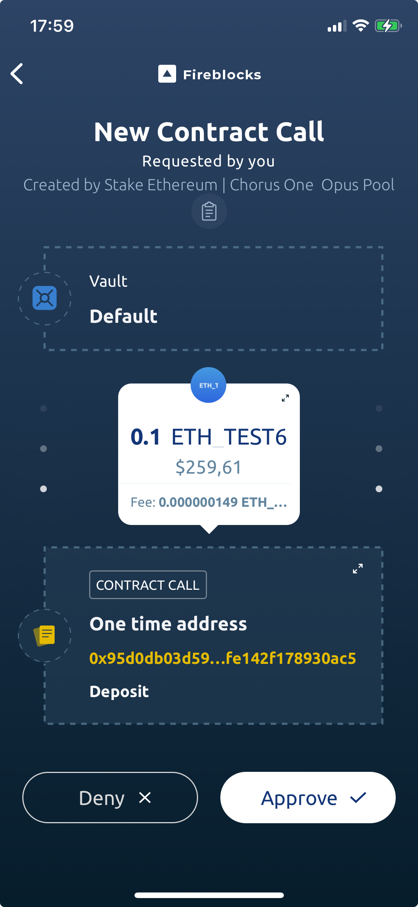

# Using Fireblocks with Chorus One Staking

<figure><figcaption></figcaption></figure>

## Overview

In order to integrate Chorus One Staking with Fireblocks, we will be using the built in WalletConnect functionality to gather the information we need to connect your Fireblocks account to [Chorus One Ethereum Staking](./).

As a brief overview, [WalletConnect](https://walletconnect.com/) is an open-source protocol that enables secure and decentralized connections between various blockchain wallets and dApps (decentralized applications). Users can interact with dApps like OPUS Pool from their mobile wallets to manage and execute transactions without exposing private keys.

[Fireblocks](https://www.fireblocks.com/) is a secure and enterprise-grade platform designed to manage digital assets and crypto transactions, providing solutions for securely transferring, storing, and issuing digital assets, with features like multi-party computation (MPC) and a network of trusted partners.

So how do we get these two interfaces to work together to integrate with OPUS Pool? Read on!&#x20;

***

### Step 1: Connect to OPUS Pool via WalletConnect

When first landing on the OPUS Pool [page](https://opus.chorus.one/pool/stake/), click on the '**Connect wallet**' button in the upper-right hand side of your screen.&#x20;

<figure><figcaption></figcaption></figure>

Next, you will be prompted with a connection method. In this case, we are choosing WalletConnect as illustrated below.&#x20;

<figure><figcaption></figcaption></figure>

You'll see a screen like the following:

<figure><figcaption><p>Note we have two options here, the QR code, or the Fireblocks button.</p></figcaption></figure>

### Step 2: Choosing Your Connection Preference

From here, you'll have two options on how to proceed.&#x20;

**1.)** Connect to your Fireblocks account via the Fireblocks button.

* This can be done via your web browser, however, signing transactions will still be done via Fireblocks on your mobile device.&#x20;

**2.)** Connect to OPUS Pool via the Wallet Connect QR code from your Fireblocks account.

* This will require the use of a mobile device to access your Fireblocks account. Signing will also take place via your Fireblocks app on your mobile device.&#x20;


Either option is equally viable, it just comes down to which you prefer.&#x20;

To connect directly via your Fireblocks account, please read on for [Option 1: Connecting via Fireblocks](using-fireblocks-with-chorus-one-staking.md#option-1-connecting-via-fireblocks).

Alternatively, to connect via QR code, skip ahead to [Option 2: Connecting via QR Code](using-fireblocks-with-chorus-one-staking.md#option-2-connecting-via-qr-code).


***

### Option 1: Connecting via Fireblocks

From the WalletConnect popup window we saw before, select the Fireblocks button to the right of the MetaMask and Ledger buttons.&#x20;

<figure><figcaption></figcaption></figure>

This will open a new browser tab where you will be prompted to first login to your Fireblocks account then connect your Fireblocks vault to OPUS Pool.&#x20;

* You'll see a screen similar to the screenshot below:&#x20;

<figure><figcaption><p>Illustration of connecting your Fireblocks vault to OPUS Pool.</p></figcaption></figure>

Click '**Connect vault**' and after some loading time has passed, this window will disappear and you will see something similar to the following in your Fireblocks dashboard.&#x20;

<figure><figcaption><p>You've successfully linked your Fireblocks account to OPUS Pool.</p></figcaption></figure>

Next, leave this window open and navigate back to the tab where you have OPUS Pool open in your browser.&#x20;

Now you should see your wallet connected and you will be ready to stake using the OPUS Pool interface.


When you finalize your transactions, you will need to sign via your Fireblocks app on your mobile device.&#x20;


If you'd like a refresher on the staking steps for OPUS Pool, please see:&#x20;

* [How to stake with OPUS Pool](../../guides/how-to-stake/staking-and-restaking-eth.md#how-to-stake-with-opus-pool)

As you go through the staking process, you'll be able to check on the progress of the staking transactions via your Fireblocks account.&#x20;

For example, you may see statuses such as:&#x20;

```
Queued, Pending Signature, Confirming, Completed
```

Here's some examples of how this may look in your Fireblocks account.&#x20;

 


And you're all set!&#x20;

You've successfully staked in OPUS Pool via your Fireblocks account.&#x20;


***

### Option 2: Connecting via QR Code

First, open up your Fireblocks app on your mobile device and select the 'Scan' button. It can be seen just to the left of the gear icon, highlighted in the screenshot below.&#x20;

* All transactions will be finalized and signed via your Fireblocks app on your mobile device.&#x20;

<figure><figcaption><p>Please select the button highlighted above to open the QR code scanner.</p></figcaption></figure>


This will open up a scan function on your mobile device.&#x20;

Use this to scan the WalletConnect QR code that is open in your browser.&#x20;


Next, select the Fireblocks vault you wish to stake from.

<figure><figcaption></figcaption></figure>

Once you've selected your vault, select '**Connect**'.

<figure><figcaption><p>You can select a faster default fee, however, leaving it set to Medium is fine. </p></figcaption></figure>

You'll be prompted to confirm the connection. You can do so by pressing on '**Got it**'.

<figure><figcaption><p>Final confirmation screen before processing the transaction.</p></figcaption></figure>

Now if you navigate back to OPUS Pool in your browser, you will be able to see your connected Fireblocks wallet.&#x20;

You can proceed with staking as normal.&#x20;

If you'd like a refresher on the staking steps for OPUS Pool, please see:&#x20;

* [How to stake with OPUS Pool](../../guides/how-to-stake/staking-and-restaking-eth.md#how-to-stake-with-opus-pool)


As you go through the staking process, you'll be prompted to sign any transactions in your Fireblocks mobile app.&#x20;

* Simply put, you'll initiate the staking transactions via OPUS Pool and sign them from your Fireblocks app.&#x20;


Here's a screenshot example shown below.&#x20;

<figure><figcaption><p>Example of a transaction prompt from OPUS Pool in Fireblocks.</p></figcaption></figure>

Click on '**View**' to see the transaction details before you sign it.&#x20;

<figure><figcaption><p>Here you can review the transaction before signing it. </p></figcaption></figure>

If all looks good, tap on '**Approve**' to sign and submit the transaction.&#x20;


You'll likely be prompted for your Fireblocks password or FaceID to approve the transaction.&#x20;


After submitting it, you can view your Fireblocks dashboard from either your mobile or web browser interface to review your recent activity.&#x20;

<figure><figcaption><p>Here you can review your recent activity. </p></figcaption></figure>


And that's it!&#x20;

You've successfully completed a transaction in OPUS Pool using Fireblocks in your mobile app.&#x20;


***
